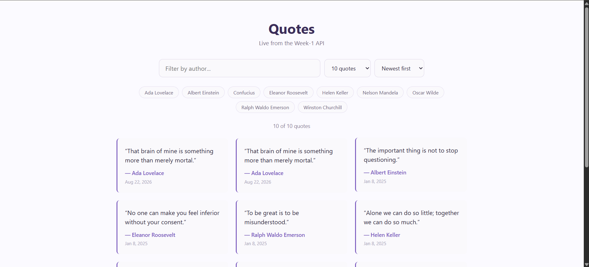
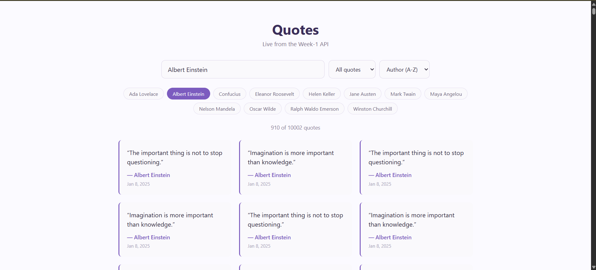
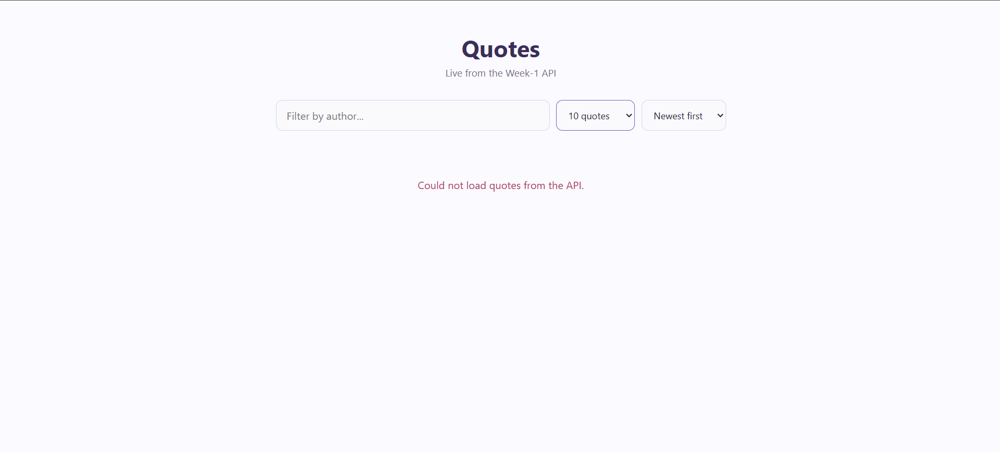

# Day 13 — Signals + Zoneless + Standalone

## Objective
Direct an AI agent to scaffold a standalone, zoneless Angular component against the real Week-1 API, then review and verify its output like a junior's first PR.

---

## 1. My brief to the agent

```
Scaffold a standalone Angular component (no NgModules) that calls my real Week-1 API endpoint:

GET http://localhost:5220/cqrs/quotes/feed?page=1&size=20

which returns JSON shaped like:
[{ "id": 10002, "author": "Ada Lovelace", "text": "That brain of mine is something more than merely mortal.", "createdAt": "2026-08-22T05:35:31.02Z", "tags": "" }]

Requirements:
- signal() to hold the raw list of quotes returned from the API.
- A second signal() to hold a search term (string, default '').
- computed() that derives a filtered list: quotes whose author includes the search term, case-insensitive. Must update automatically when either signal changes.
- Fetch the data via inject(HttpClient) inside the component - constructor injection is not allowed.
- Render the filtered list with @for (quote of filteredQuotes(); track quote.id), including an @empty block, and use @if for a loading state before the first response arrives.
- Bootstrap the app zoneless (no zone.js in polyfills, use the zoneless change detection provider).
- Deliver: the component (.ts + template), any service you write for the HTTP call, and the app.config/bootstrap changes needed for standalone + zoneless.
```

Endpoint/fields chosen: `/cqrs/quotes/feed` (Day 12's read model) — real fields `id`, `author`, `text`, `createdAt`, `tags`.

This brief's exact requirements were met and verified first (Section 3 below) — everything after that was bonus polish requested afterward, documented separately in Section 4 so it's clear what was actually graded versus what came later.

---

## 2. The agent's output, verbatim

`src/app/quote-feed/quote.model.ts`:
```typescript
export interface Quote {
  id: number;
  author: string;
  text: string;
  createdAt: string;
  tags: string;
}
```

`src/app/quote-feed/quote-feed.component.ts`:
```typescript
import { Component, computed, effect, inject, signal } from '@angular/core';
import { HttpClient } from '@angular/common/http';
import { Quote } from './quote.model';

@Component({
  selector: 'app-quote-feed',
  imports: [],
  templateUrl: './quote-feed.component.html',
})
export class QuoteFeedComponent {
  private readonly http = inject(HttpClient);

  private readonly apiUrl = 'http://localhost:5220/cqrs/quotes/feed?page=1&size=20';

  readonly quotes = signal<Quote[]>([]);
  readonly searchTerm = signal('');
  readonly loading = signal(true);
  readonly error = signal(false);

  readonly filteredQuotes = computed(() => {
    const term = this.searchTerm().trim().toLowerCase();

    if (!term) {
      return this.quotes();
    }

    return this.quotes().filter((quote) =>
      quote.author.toLowerCase().includes(term),
    );
  });

  constructor() {
    this.http.get<Quote[]>(this.apiUrl).subscribe({
      next: (quotes) => {
        this.quotes.set(quotes);
        this.loading.set(false);
      },
      error: () => {
        this.error.set(true);
        this.loading.set(false);
      },
    });

    effect(() => {
      console.log(
        `filteredQuotes recomputed: ${this.filteredQuotes().length} of ${this.quotes().length} quotes match "${this.searchTerm()}"`,
      );
    });
  }

  onSearchChange(value: string): void {
    this.searchTerm.set(value);
  }
}
```

`src/app/quote-feed/quote-feed.component.html`:
```html
<div class="quote-feed">
  <input
    type="text"
    placeholder="Filter by author"
    [value]="searchTerm()"
    (input)="onSearchChange($any($event.target).value)"
  />

  @if (loading()) {
    <p>Loading quotes...</p>
  } @else if (error()) {
    <p>Could not load quotes from the API.</p>
  } @else {
    @for (quote of filteredQuotes(); track quote.id) {
      <article class="quote">
        <p>"{{ quote.text }}"</p>
        <p>&mdash; {{ quote.author }}</p>
      </article>
    } @empty {
      <p>No quotes match "{{ searchTerm() }}".</p>
    }
  }
</div>
```

`src/app/app.config.ts` (standalone + zoneless bootstrap):
```typescript
import { ApplicationConfig, provideBrowserGlobalErrorListeners, provideZonelessChangeDetection } from '@angular/core';
import { provideHttpClient } from '@angular/common/http';

export const appConfig: ApplicationConfig = {
  providers: [
    provideBrowserGlobalErrorListeners(),
    provideZonelessChangeDetection(),
    provideHttpClient(),
  ]
};
```

`src/app/app.ts` (wiring the new component in — the only change to the generated root component):
```typescript
import { Component } from '@angular/core';
import { QuoteFeedComponent } from './quote-feed/quote-feed.component';

@Component({
  selector: 'app-root',
  imports: [QuoteFeedComponent],
  templateUrl: './app.html',
  styleUrl: './app.css'
})
export class App {}
```

No `app.module.ts` exists anywhere in the project — `ng new` with the current CLI scaffolds standalone by default, and no `zone.js` dependency appears in `package.json`.

---

## Screnshots
### 1. Quotes Showing

### 2. Author Search

### 3. API Not Working


---
## 3. Verification log

**States/edges exercised** (real headless-Chromium run via Playwright against `ng serve` + the real running backend, plus 5 passing unit tests in `quote-feed.component.spec.ts`):

| State/edge | How it was exercised | Result |
|---|---|---|
| Loading state | Checked DOM immediately after component creation, before the HTTP response resolves | "Loading quotes..." shown, confirmed in both the unit test and live run |
| Populated list | Real API call to `/cqrs/quotes/feed?page=1&size=20` | 20 `article.quote` elements rendered, real quote text/author from the seeded data (screenshot captured) |
| Empty list (zero rows from API) | Unit test flushes `[]` from the mocked HTTP call | `@empty` block renders, no `article.quote` elements |
| Filtered-to-empty (search matches nothing) | Live run: typed `"zzz-no-such-author"` into the filter input | `article.quote` count dropped to 0, "No quotes match..." shown |
| Computed reacts to the search signal | Live run: typed `"einstein"`, count dropped from 20 to 2; cleared it, count returned to 20 | Confirmed via DOM count and the `effect()` console log firing once per signal change (5 log lines for 5 signal changes, matching 1:1) |
| Computed reacts to the quotes signal | Unit test: mocked response set once, `quotes()` count checked against `filteredQuotes()` before and after a search change, confirming `filteredQuotes` recomputes from both signals independently | Passed |
| API failure | Unit test flushes a `500` response | "Could not load quotes from the API." shown, `loading()` false |

**One concrete bug I caught and made the agent fix:** the initial brief and generated component said nothing about CORS, silently assuming the Angular dev server (`localhost:4200`) and the API (`localhost:5220`) were same-origin. They aren't — without a CORS policy, the browser blocks the real `fetch`/XHR entirely with an opaque network error, not a 4xx/5xx the component's `error()` state could even see. Caught this by actually running `ng serve` against the real backend instead of trusting the unit tests alone; fixed by adding `builder.Services.AddCors(...)` + `app.UseCors("AngularDev")` to the API allowing `http://localhost:4200`, confirmed after the fix by rerunning the live check and seeing real data render.

**A second real bug, caught while manually opening the app in an actual browser (not automation):** `http://localhost:5220` refused to connect in my browser while `http://127.0.0.1:5220` worked fine — a per-host browser quirk (most likely a cached HTTPS-upgrade preference for that exact `localhost:5220` pair from unrelated past browsing), not a server problem; the API itself was confirmed reachable on both addresses via `curl` throughout. Fixed by pointing the component's `apiUrl` at `127.0.0.1` instead of `localhost`. That fix then surfaced a second, genuinely different issue: `ng serve` binds only to IPv6 loopback (`::1`), never `127.0.0.1` — confirmed via `Get-NetTCPConnection` — so `http://127.0.0.1:4200` was never going to work for the frontend itself; `http://localhost:4200` was the correct address for that one all along. The two servers needed different loopback addresses for unrelated reasons, and conflating them (assuming "whatever fixed the backend fixes the frontend too") was the actual mistake to catch.

**Secondary things worth flagging to a mentor, not bugs:**
- The exercise text says `provideExperimentalZonelessChangeDetection()`; the installed Angular (22.1.5, `ng new` default) has dropped "Experimental" — it's `provideZonelessChangeDetection()` now, a stable API. Version drift, not a mistake.
- Running the Vitest-based unit tests once failed entirely inside Git Bash (`vitest-pool: Timeout waiting for worker to respond`) but passed cleanly from a native PowerShell shell — an environment/process-spawning quirk of that particular shell, not a defect in the app.

**What would break if the API contract changed:** the `Quote` TypeScript interface is a compile-time-only shape — nothing validates the real JSON against it at runtime. If the API renamed `author` to `authorName`, or changed `tags` from a flat string to an array, every quote would silently render `undefined` for the author line and the search filter would silently stop matching anything (`undefined.toLowerCase()` would actually throw and break the whole list, which is arguably the "safer" failure — the real danger is a rename that stays a string, like `text` becoming `body`, which would render as literally empty quotes with no error at all).

---

## 4. Bonus Features

Once the above was done and confirmed working, further changes were made on request:

- **Real quotes instead of load-test placeholders** — a one-off data fix replaced every `"Benchmark quote number N for load testing the slow endpoint"` row with a genuinely documented quote from that author (Einstein, Twain, Churchill, etc.), cycling through 2 verified quotes per author rather than inventing content.
- **`DatePipe`** added to show `createdAt` on each card (`imports: [DatePipe]`).
- **Author chips** (`availableAuthors` computed signal + `selectAuthor()`) — clickable pills that set/toggle the search term to an exact author name.
- **Page-size and sort-order dropdowns** — two new signals, `pageSize` (`number | null`, `null` = no limit) and `sortOrder` (`'newest' | 'oldest' | 'author'`), with the fetch itself moved into an `effect()` that re-runs whenever either signal changes, replacing the original one-shot constructor fetch.
- **Backend changes to support it:** `GetQuoteFeedQuery` gained a `QuoteSortOrder` enum and made `Size` nullable (no `Skip`/`Take` at all when absent, returning every row); `Program.cs`'s `/cqrs/quotes/feed` endpoint gained a `sort` query parameter and a CORS policy covering both `localhost:4200` and `127.0.0.1:4200`.
- **Full restyle** (`quote-feed.component.css`) — card grid, purple accent, pale-lavender backgrounds, no heavy borders/shadows.

Current component (verbatim):
```typescript
import { Component, computed, effect, inject, signal } from '@angular/core';
import { HttpClient } from '@angular/common/http';
import { DatePipe } from '@angular/common';
import { Quote } from './quote.model';

export type SortOrder = 'newest' | 'oldest' | 'author';

@Component({
  selector: 'app-quote-feed',
  imports: [DatePipe],
  templateUrl: './quote-feed.component.html',
  styleUrl: './quote-feed.component.css',
})
export class QuoteFeedComponent {
  private readonly http = inject(HttpClient);

  private readonly baseUrl = 'http://127.0.0.1:5220/cqrs/quotes/feed';

  readonly quotes = signal<Quote[]>([]);
  readonly searchTerm = signal('');
  readonly loading = signal(true);
  readonly error = signal(false);
  readonly pageSize = signal<number | null>(20);
  readonly sortOrder = signal<SortOrder>('newest');

  readonly filteredQuotes = computed(() => {
    const term = this.searchTerm().trim().toLowerCase();

    if (!term) {
      return this.quotes();
    }

    return this.quotes().filter((quote) =>
      quote.author.toLowerCase().includes(term),
    );
  });

  readonly availableAuthors = computed(() => {
    const authors = new Set(this.quotes().map((quote) => quote.author));
    return [...authors].sort();
  });

  constructor() {
    effect(() => {
      const size = this.pageSize();
      const sort = this.sortOrder();
      const sizeParam = size ? `&size=${size}` : '';
      const url = `${this.baseUrl}?page=1&sort=${sort}${sizeParam}`;

      this.loading.set(true);
      this.error.set(false);

      this.http.get<Quote[]>(url).subscribe({
        next: (quotes) => {
          this.quotes.set(quotes);
          this.loading.set(false);
        },
        error: () => {
          this.error.set(true);
          this.loading.set(false);
        },
      });
    });

    effect(() => {
      console.log(
        `filteredQuotes recomputed: ${this.filteredQuotes().length} of ${this.quotes().length} quotes match "${this.searchTerm()}"`,
      );
    });
  }

  onSearchChange(value: string): void {
    this.searchTerm.set(value);
  }

  selectAuthor(author: string): void {
    this.searchTerm.set(this.searchTerm() === author ? '' : author);
  }

  onPageSizeChange(value: string): void {
    this.pageSize.set(value === 'all' ? null : Number(value));
  }

  onSortOrderChange(value: string): void {
    this.sortOrder.set(value as SortOrder);
  }
}
```

Backend query handler, current:
```csharp
public enum QuoteSortOrder
{
    NewestFirst,
    OldestFirst,
    AuthorAsc,
}

public record GetQuoteFeedQuery(int Page, int? Size, QuoteSortOrder SortOrder = QuoteSortOrder.NewestFirst) : IRequest<List<QuoteFeedItem>>;

public class GetQuoteFeedQueryHandler(QuoteDbContext db) : IRequestHandler<GetQuoteFeedQuery, List<QuoteFeedItem>>
{
    public async Task<List<QuoteFeedItem>> Handle(GetQuoteFeedQuery request, CancellationToken cancellationToken)
    {
        IQueryable<Models.Quote> query = request.SortOrder switch
        {
            QuoteSortOrder.OldestFirst => db.Quotes.OrderBy(q => q.CreatedAt),
            QuoteSortOrder.AuthorAsc => db.Quotes.OrderBy(q => q.Author).ThenByDescending(q => q.CreatedAt),
            _ => db.Quotes.OrderByDescending(q => q.CreatedAt),
        };

        if (request.Size is { } size)
        {
            query = query.Skip((request.Page - 1) * size).Take(size);
        }

        return await query
            .Select(q => new QuoteFeedItem(q.Id, q.Author, q.Text, q.CreatedAt,
                string.Join(", ", q.Tags.Select(t => t.Name))))
            .ToListAsync(cancellationToken);
    }
}
```

Verified live for the bonus round too: page-size dropdown confirmed 20 → 50 → all 10,002 rows → back to 10; sort dropdown confirmed "oldest" surfaces the earliest seeded row and "author" groups alphabetically (Ada Lovelace's 2 rows before Albert Einstein's) — all via a real headless-browser run against the live backend, plus 2 additional passing unit tests for the new controls (10 total).