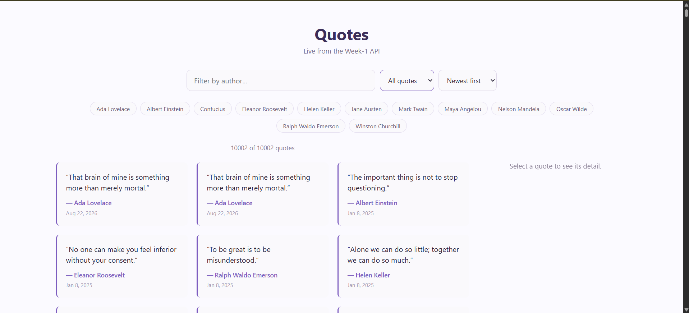
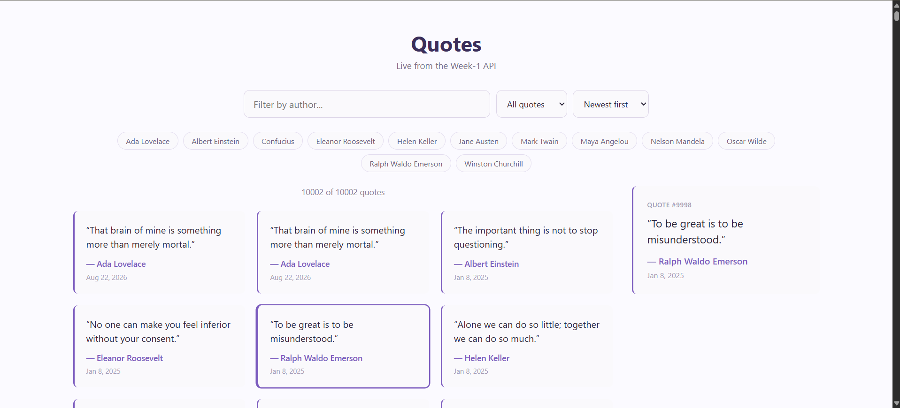
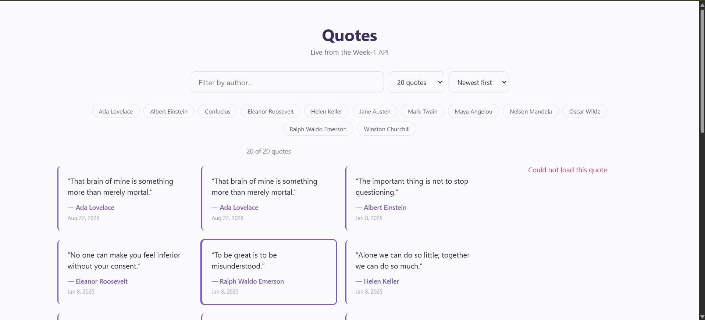

## Objective

Direct an agent to build a quotes list+detail component against the real Week-1 API, then review its output like a colleague's PR: exercise loading/error/empty/race states, catch at least one real mistake, and document what breaks if the API contract changes.

## 1. Brief given to the agent

> **Goal**: Add a detail view to the existing quotes feed: clicking a quote in the list shows its full detail (including real tag objects, not just the joined tag string the list uses) in a separate panel/component.
>
> **Real API contract** (Week-1 QuotesApi, base `http://127.0.0.1:5220`)
>
> List — `GET /cqrs/quotes/feed?page={n}&size={n}&sort={newest|oldest|author}` returns `QuoteFeedItem[]`:
> ```ts
> interface QuoteFeedItem {
>   id: number;
>   author: string;
>   text: string;
>   createdAt: string; // ISO datetime
>   tags: string;       // comma-joined tag names, e.g. "wisdom, science" or ""
> }
> ```
>
> Detail — `GET /api/quotes/{id}` returns `Quote` on 200, **404 with no body if the id doesn't exist**:
> ```ts
> interface Tag { id: number; name: string; }
> interface Quote {
>   id: number;
>   author: string;
>   text: string;
>   userId: number;
>   createdAt: string;
>   tags: Tag[];         // array of tag OBJECTS — not the joined string the feed uses
> }
> ```
> Note the shape difference on purpose: `QuoteFeedItem.tags` is a string, `Quote.tags` is `Tag[]`. Do not assume they match.
>
> **What to build**: `QuoteService` (`inject(HttpClient)`) with `getFeed()`/`getById()`; a new `QuoteDetailComponent` with `loading`/`error`/`data` signals, wired to the list via a selected-id signal. Fully typed, no `any`.
>
> **States to verify**: loading, error, empty (nothing selected), and the race — click quote A then immediately quote B before A's response lands; the panel must end up showing B, not whichever response arrives last.

## 2. Agent's output (component + service)

`quote.model.ts` — split the single `Quote` type into the two real, distinct shapes:
```typescript
export interface QuoteFeedItem {
  id: number;
  author: string;
  text: string;
  createdAt: string;
  tags: string;
}

export interface Tag {
  id: number;
  name: string;
}

export interface QuoteDetail {
  id: number;
  author: string;
  text: string;
  userId: number;
  createdAt: string;
  tags: Tag[];
}
```

`quote.service.ts`:
```typescript
@Injectable({ providedIn: 'root' })
export class QuoteService {
  private readonly http = inject(HttpClient);
  private readonly baseUrl = 'http://127.0.0.1:5220';

  getFeed(page: number, size: number | null, sort: SortOrder): Observable<QuoteFeedItem[]> {
    const sizeParam = size ? `&size=${size}` : '';
    return this.http.get<QuoteFeedItem[]>(`${this.baseUrl}/cqrs/quotes/feed?page=${page}&sort=${sort}${sizeParam}`);
  }

  getById(id: number): Observable<QuoteDetail> {
    return this.http.get<QuoteDetail>(`${this.baseUrl}/api/quotes/${id}`);
  }
}
```

`quote-detail.component.ts` (final, after the fix described in section 3):
```typescript
export class QuoteDetailComponent {
  private readonly quoteService = inject(QuoteService);

  readonly quoteId = input<number | null>(null);
  readonly quote = signal<QuoteDetail | null>(null);
  readonly loading = signal(false);
  readonly error = signal(false);

  constructor() {
    effect(() => {
      const id = this.quoteId();

      if (id === null) {
        this.quote.set(null);
        this.loading.set(false);
        this.error.set(false);
        return;
      }

      this.loading.set(true);
      this.error.set(false);

      this.quoteService.getById(id).subscribe({
        next: (quote) => {
          if (this.quoteId() !== id) return; // guard: id changed while this request was in flight
          this.quote.set(quote);
          this.loading.set(false);
        },
        error: () => {
          if (this.quoteId() !== id) return;
          this.error.set(true);
          this.loading.set(false);
        },
      });
    });
  }
}
```

The existing `QuoteFeedComponent` (list) got a `selectedId` signal and a click handler; clicking a card toggles selection and passes `[quoteId]="selectedId()"` down to `<app-quote-detail>`.

## 3. Verification log

**States exercised:**

| State | How verified | Result |
|---|---|---|
| Loading | Unit test (`quote-detail.component.spec.ts`) asserts "Loading detail..." renders before the HTTP mock flushes | Pass |
| Empty | Unit test + live: with nothing selected, panel shows "Select a quote to see its detail." | Pass |
| Error | Live: killed the real backend process mid-session, selected a *new* quote (one not yet cached) — panel showed "Could not load this quote." The list's own error ("Could not load quotes from the API.") was verified separately by loading the page with the backend already down. | Pass |
| Race | Unit test with `HttpTestingController`: select quote A, then quote B before flushing A; flush B first, then flush the stale A response. Also reproduced with a real headless-browser click (Playwright) against the live API, clicking Ada Lovelace's card then Albert Einstein's card back-to-back. | See below — this is where the agent's first pass was wrong. |

**The bug caught and fixed:** the first implementation used the same `effect()` + `.subscribe()` pattern already present in the codebase's list component — no guard against a late response overwriting a newer selection. The race unit test failed immediately:

```
does not let a stale response for quote A overwrite quote B once B is selected
AssertionError: expected '"That brain of mine..." — Ada Lovelace' to contain 'Albert Einstein'
```

Quote B's response was flushed first (as it should render), then quote A's stale response arrived and silently overwrote it back to quote A — exactly the bug the brief warned about. Fix: capture the requested `id` in a closure and check `this.quoteId() !== id` before applying either the `next` or `error` result, so a response for a selection that's no longer current is dropped. After the fix, all 14 unit tests pass, and a live Playwright run against the real API (clicking Ada Lovelace's card then Albert Einstein's card with no delay) correctly landed on Albert Einstein.

**Also caught while wiring this up (test-harness mistake, not app code):** my first version of the race test drove the "selected id" through a plain mutable field on a test host component. Under this app's zoneless change detection, a plain field mutation doesn't reactively update a child's signal input — only reading an actual signal in the template does. The test host had to hold `id` as a `signal()` and bind `[quoteId]="id()"`, matching how the real `QuoteFeedComponent` does it. Worth flagging because it's a real gotcha specific to zoneless testing, even though it wasn't a production bug.

**Incidental finding, out of scope:** `dotnet test` on this Piece2 copy shows one pre-existing failure, `AuthorizationTests.DeleteQuoteOwnedByAnotherUser_Returns403`. It hardcodes deleting `/api/quotes/1` and assumes that id doesn't exist yet in a fresh DB. Piece2's SQLite file was copied from Piece1, which already has a real seeded quote at id 1 owned by the test's own user — so the delete succeeds (204) instead of being forbidden (403). This is a test-isolation issue in the copied database, not something introduced by the list+detail work, and it's unrelated to this task's scope, so it was left alone.

## 4. What breaks if the Week-1 API contract changes

- If `/cqrs/quotes/feed` ever starts returning `tags` as an array (to match the detail endpoint) instead of a joined string, `QuoteFeedItem` and the list template's implicit string usage would silently mismatch — TypeScript wouldn't catch it because the HTTP response isn't structurally checked at runtime, and the joined text would just render as `[object Object]` or a raw array string.
- If `/api/quotes/{id}` ever returned `null`/`{}` on a 200 instead of a real 404 for a missing quote, the current error-only guard would miss it — the panel would try to render an empty/undefined quote instead of showing "Could not load this quote."
- If a future field rename on the backend (e.g. `createdAt` → `created_at`) shipped without a matching model update, the `DatePipe` binding would throw at render time for `undefined` rather than failing at compile time, since the HTTP response is trusted as-typed with no runtime validation.

## Screenshots
### 1. Quotes Showing

### 2. Author Search

### 3. API Not Working
