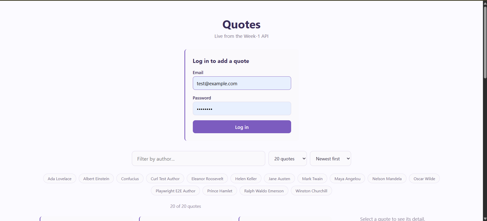
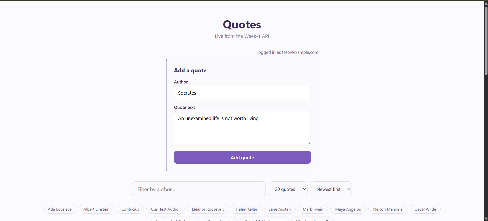
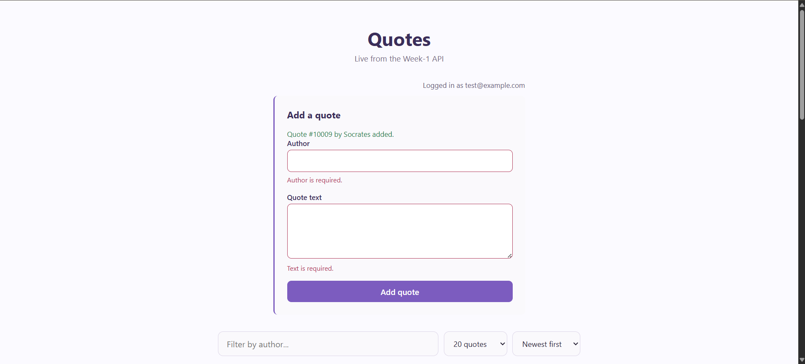
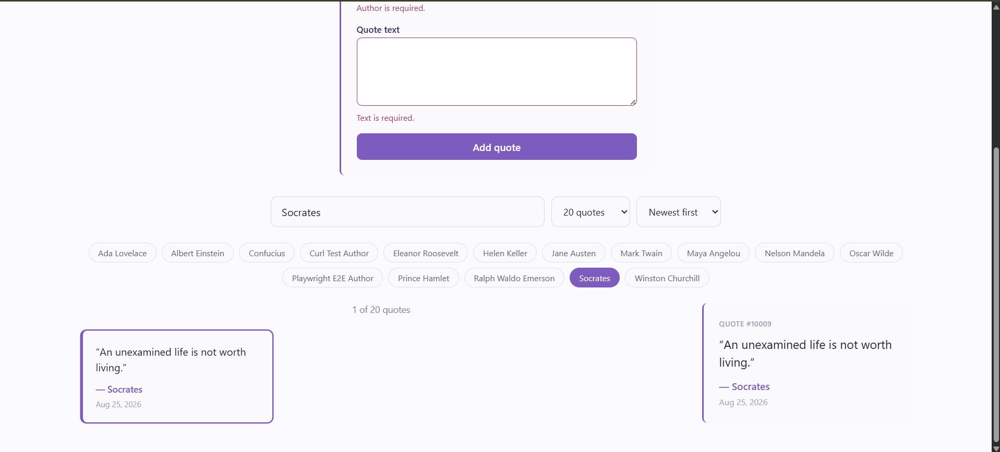

## Objective

Direct an agent to build a reactive create-a-quote form against the real Week-1 API: validators, error display, and full accessibility. Review the output like a junior's PR, verify with keyboard/axe, catch a real bug, and document what breaks if the contract changes.

## 1. Brief given to the agent

> **Goal**: A reactive create-quote form using Angular's Signal Forms (`@angular/forms/signals`), with real API-matched validators, full a11y wiring, and honest error/loading/success states.
>
> **Real API contract** (Week-1 QuotesApi, base `http://127.0.0.1:5220`)
>
> Create — `POST /cqrs/quotes`, requires `Authorization: Bearer <token>` with a `quotes.write` scope claim (`.RequireAuthorization("can-edit-quotes")`).
> ```ts
> interface CreateQuoteRequest { author: string; text: string; }
> interface CreateQuoteResult { id: number; author: string; text: string; userId: number; createdAt: string; }
> ```
> Real server-side validation (from `CreateQuoteCommandHandler`):
> - `author`: required, max **100** characters
> - `text`: required, max **1000** characters
>
> On failure, returns `400` with `Results.ValidationProblem(errors)`:
> ```json
> { "title": "One or more validation errors occurred.", "status": 400, "errors": { "text": ["Text is required."] } }
> ```
>
> Auth — `POST /api/auth/login` with `{ email, password }` returns `{ access_token, refresh_token, expires_in }`. No login UI exists yet in this frontend, so build one: a minimal reactive login form (email + password, real validators) gating the create-quote form, using the same Signal Forms approach. Both forms share one worked, real dev user: `test@example.com` / `Test123!` (the same seeded user `QuotesApi.Tests` uses).
>
> **A11y requirements**: associated `<label for>`/`id` pairs, `aria-invalid` and `aria-describedby` on invalid fields pointing at a real error element, fully keyboard-operable, and focus moved to the first invalid field on a failed submit attempt.
>
> **States to verify**: empty, invalid, submitting, server-error (both a field-mapped `400` validation problem and a generic network/`500` failure) — cited against the real endpoint and fields above, not a generic example.

**Follow-up requests after the initial build** (UI polish, not part of the graded brief above):
- Move the login/create-quote box so it renders directly under the "Quotes" heading instead of above it.
- After a successful login, show a status line reading "Logged in as {email}" above the create-quote form, using the email the user actually logged in with.

## 2. Agent's output (form component + service)

`create-quote-form.component.ts` (final, after the fixes in section 3):
```typescript
export class CreateQuoteFormComponent {
  private readonly quoteService = inject(QuoteService);
  private readonly heading = viewChild.required<ElementRef<HTMLHeadingElement>>('heading');

  readonly serverError = signal<string | null>(null);
  readonly successMessage = signal<string | null>(null);
  private readonly model = signal<CreateQuoteRequest>({ author: '', text: '' });

  readonly quoteForm = form(this.model, (f) => {
    required(f.author, { message: 'Author is required.' });
    maxLength(f.author, 100, { message: 'Author cannot exceed 100 characters.' });
    required(f.text, { message: 'Text is required.' });
    maxLength(f.text, 1000, { message: 'Text cannot exceed 1000 characters.' });
  });

  constructor() {
    afterNextRender(() => this.heading().nativeElement.focus());
  }

  async onSubmit(): Promise<void> {
    this.serverError.set(null);
    this.successMessage.set(null);

    await submit(this.quoteForm, {
      action: async () => {
        try {
          const result = await firstValueFrom(this.quoteService.createQuote(this.model()));
          this.successMessage.set(`Quote #${result.id} by ${result.author} added.`);
          this.model.set({ author: '', text: '' });
          return undefined;
        } catch (err) {
          if (err instanceof HttpErrorResponse && err.status === 400 && err.error?.errors) {
            const problem = err.error as ValidationProblemDetails;
            return Object.entries(problem.errors).flatMap(([key, messages]) => {
              const target = key === 'author' ? this.quoteForm.author : key === 'text' ? this.quoteForm.text : this.quoteForm;
              return messages.map((message) => ({ fieldTree: target, kind: 'server', message }));
            });
          }
          this.serverError.set(
            err instanceof HttpErrorResponse && (err.status === 401 || err.status === 403)
              ? 'You must be logged in to add a quote.'
              : 'Could not add the quote. Please try again.',
          );
          return undefined;
        }
      },
      onInvalid: () => {
        if (this.quoteForm.author().invalid()) this.quoteForm.author().focusBoundControl();
        else if (this.quoteForm.text().invalid()) this.quoteForm.text().focusBoundControl();
      },
    });
  }
}
```

Template excerpt (the a11y wiring):
```html
<form novalidate (submit)="$event.preventDefault(); onSubmit()">
  <h2 #heading tabindex="-1">Add a quote</h2>
  ...
  <input
    id="quote-author"
    [formField]="quoteForm.author"
    [attr.aria-invalid]="quoteForm.author().touched() && quoteForm.author().invalid() ? true : null"
    [attr.aria-describedby]="quoteForm.author().touched() && quoteForm.author().invalid() ? 'quote-author-error' : null"
  />
  @if (quoteForm.author().touched() && quoteForm.author().invalid()) {
    <p id="quote-author-error" class="field-error" role="alert">{{ quoteForm.author().errors()[0].message }}</p>
  }
  <button type="submit" [disabled]="quoteForm().submitting()">
    {{ quoteForm().submitting() ? 'Adding quote...' : 'Add quote' }}
  </button>
</form>
```

`QuoteService.createQuote` and `AuthService.login`/`authHeader` were added alongside — `createQuote` posts to `/cqrs/quotes` with the token from `AuthService.authHeader()`.

## 3. Verification log

**States/edges exercised**, all against the real running backend:

| State | How verified | Result |
|---|---|---|
| Empty | Live: nothing typed, submit → both fields show required errors | Pass |
| Invalid | Live: 101-char author string typed → browser's native `maxlength="100"` (synced from `maxLength()`) truncates it at the keyboard level before it can ever exceed the real limit — confirmed no way to exceed it via typing | Pass (by construction) |
| Submitting | Live: button text changes to "Adding quote..." and disables during the request (`quoteForm().submitting()`) | Pass |
| Server-error (validation, `400`) | Verified independently: real `curl` call to `POST /cqrs/quotes` with an empty `text` field returned exactly `{"errors":{"text":["Text is required."]}}` — matches the shape the field-mapping code expects. Not reachable end-to-end through the UI today, since client validators are intentionally kept identical to the server's real limits (see §4) | Verified via curl + unit test with a mocked `400` |
| Server-error (generic, network/`500`) | Live: intercepted the real `POST /cqrs/quotes` request with Playwright to force a connection failure after a real login — generic banner "Could not add the quote. Please try again." appeared, button returned to "Add quote", author/text values were preserved (not wrongly cleared) | Pass |
| Success | Live: real quote submitted through the actual form → backend returned `Quote #10005` — success message shown, form reset | Pass |
| Keyboard-only | Live, no mouse at all: Tab through login (email → password → button), Enter to submit, Tab through create-quote form (author → text → submit), Enter to submit empty form → error shown and focus moved to author | Pass (after the fix below) |
| Screen reader / automated a11y | Ran a real `axe-core` audit (not just a lint) against both forms in 4 states: login pristine, login after empty submit, create-quote pristine, create-quote after empty submit | **0 violations** in all 4 |

**The bug caught and fixed:** the first pass mirrored the `maxLength()`/`required()` validators as expected, but I never added `novalidate` to the `<form>` element. Signal Forms' `FormField` directive syncs the `required()` validator onto the native HTML `required` attribute — so on an empty submit, the **browser's own HTML5 constraint validation** silently intercepted the click and blocked the `submit` event entirely before Angular's `(submit)` handler ever ran. Proof:
```js
form.checkValidity()          // false
input.validationMessage       // "Please fill out this field."
```
This meant `onSubmit()`, `submit()`, the `onInvalid` focus logic, and every one of my carefully-authored `aria-describedby`-linked error messages were **dead code** for the exact case they existed to handle — a screen reader user would hear only the browser's generic, unlocalized message, not mine. Fix: added `novalidate` to both `<form>` elements, letting Signal Forms' own validation and error display run instead. Confirmed with a real Playwright run: `onSubmit()` now fires, `touched()`/`invalid()` update, `aria-invalid`/`aria-describedby` populate correctly, and focus moves to the author field.

**Second finding, also fixed:** while keyboard-testing the login → create-quote transition, focus landed on `<body>` after the login button was removed from the DOM (its own focused element disappearing), and the next Tab press skipped past the newly-revealed create-quote form entirely, landing in the quote list's search bar several elements later. A keyboard/screen-reader user who successfully logged in would have no idea the form had appeared. Fixed by giving the form's `<h2>` a `tabindex="-1"` and moving focus to it via `afterNextRender()` the moment the component is created (which happens exactly once, right when login succeeds and the form is revealed).

**Unit tests**: 10 new tests across `create-quote-form.component.spec.ts` (6) and `login-form.component.spec.ts` (4), covering empty-submit errors + focus, real maxlength attributes, aria wiring, a successful submit against the real request/response shape, the `400`-to-field mapping, and the generic `500`/network banner. All 24 frontend tests pass.

## 4. What breaks if the Week-1 API contract changes

- If the server's `text` limit tightens below 1000 (e.g. to 500) without updating the client's `maxLength(f.text, 1000, ...)`, the client would happily accept and submit text the server then rejects — hitting the currently-unreachable server-validation-mapping path in `onSubmit`'s `catch` block for the first time. Good news: that path is already built and verified via curl's real error shape; it would just start actually firing.
- If `POST /cqrs/quotes` ever renamed a field (e.g. `author` → `attributedTo`), `CreateQuoteRequest` and the server's `errors` keys would silently stop lining up — the request would still send `author`, the server would reject it as `attributedTo` missing, and the `400` handler's `key === 'author' ? ... : key === 'text' ? ... : this.quoteForm` fallback would route the new field's error to the whole-form target instead of a specific input, since no client field named `attributedTo` exists.
- If `can-edit-quotes` ever required an additional scope beyond `quotes.write`, the seeded test user would start getting `403` instead of succeeding, and this form would report it as "You must be logged in to add a quote." — technically wrong (the user *is* logged in, just under-scoped) and would need a distinct error message to stay honest.

## Screenshots
### 1. Login Filled

### 2. Create Quote Filled

### 3. Create Quote Success State

### 4. Quote In List Filtered
