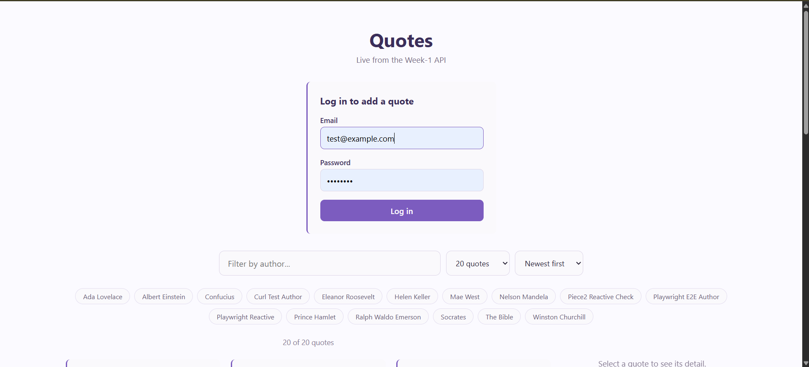
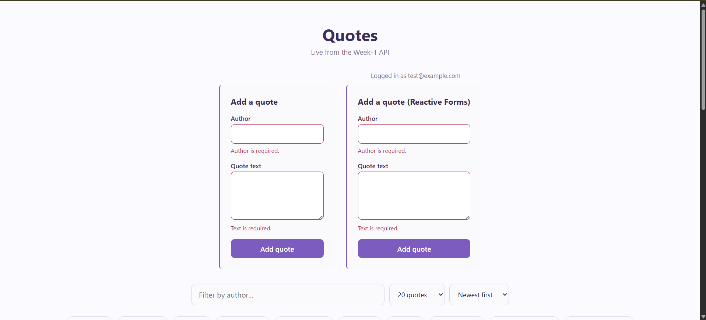
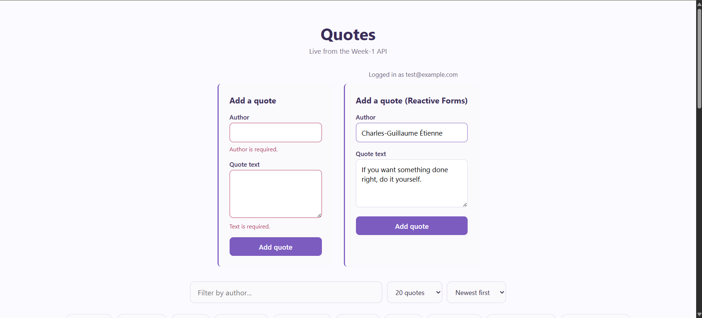
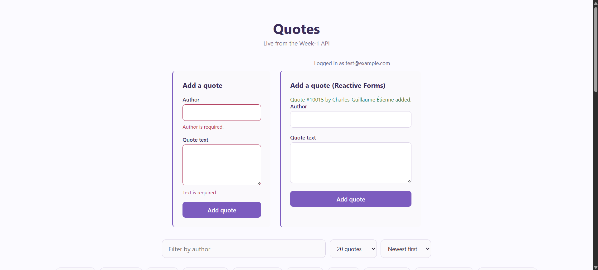
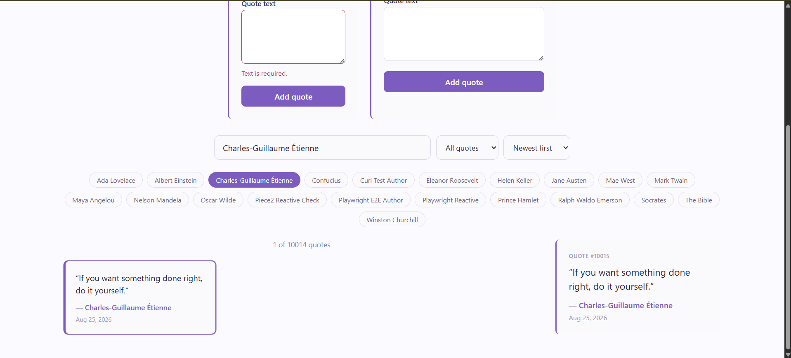

## Objective

Direct an agent to rebuild the create-quote form with classic Angular Reactive Forms (`ReactiveFormsModule`) so it can sit next to the Signal Forms version from [day-14/Piece1](../Piece1/README.md) and be compared honestly, state by state, against the same real API.

**Note on code location**: `day-14/Piece1`'s create-quote form already used the Signal Forms preview API (built in Task 1), so there was no classic-reactive-forms version anywhere in the repo to diff against. Rather than fake one up after the fact, `day-14/Piece2` is a fresh copy of Piece1's whole app (`QuotesApi`, `QuotesApi.Tests`, `quotes-feed`), with a new `CreateQuoteFormReactiveComponent` added alongside the existing Signal Forms component and rendered side by side after login — so both are exercised against the exact same real backend, same auth token, same real quotes, in one page, without touching Piece1 at all.

## 1. Brief given to the agent

> **Goal**: Rebuild the create-quote form using classic Angular Reactive Forms (`FormBuilder`/`FormGroup`/`Validators` from `@angular/forms`), rendered alongside the existing Signal Forms version (`create-quote-form.component.ts`, carried over unchanged from Piece1 into this copy) after login, against the same real API.
>
> **Real API contract** (Week-1 QuotesApi, base `http://127.0.0.1:5220`) — identical to Piece1's:
>
> `POST /cqrs/quotes`, requires `Authorization: Bearer <token>` with a `quotes.write` scope claim.
> ```ts
> interface CreateQuoteRequest { author: string; text: string; }
> interface CreateQuoteResult { id: number; author: string; text: string; userId: number; createdAt: string; }
> ```
> Real server-side validation (from `CreateQuoteCommandHandler`): `author` required, max **100** chars; `text` required, max **1000** chars. On failure, `400` with `{ title, status, errors: { field: [messages] } }`.
>
> **Requirements**: same states as Piece1 — pristine, dirty/touched, validators firing, field-mapped `400` errors, generic network/`500` errors, clean submit with reset. Same a11y bar: `label for`/`id`, `aria-invalid`/`aria-describedby`, keyboard-operable, focus-on-invalid. Reuse `QuoteService.createQuote()` and `AuthService.authHeader()` as-is — don't duplicate the HTTP call.
>
> **Deliverable**: a short, honest comparison of where Signal Forms is simpler and where classic Reactive Forms is simpler or safer, grounded in what actually happened building both — not a generic list of framework differences.

## 2. Agent's output

`create-quote-form-reactive.component.ts` (final, after the fix in §3):

```typescript
readonly form = this.fb.nonNullable.group({
  author: ['', [Validators.required, Validators.maxLength(100)]],
  text: ['', [Validators.required, Validators.maxLength(1000)]],
});

authorErrorMessage(): string {
  const control = this.form.controls.author;
  if (control.hasError('required')) return 'Author is required.';
  if (control.hasError('maxlength')) return 'Author cannot exceed 100 characters.';
  if (control.hasError('server')) return control.getError('server');
  return '';
}

async onSubmit(): Promise<void> {
  this.serverError.set(null);
  this.successMessage.set(null);

  if (this.form.invalid) {
    this.form.markAllAsTouched();
    if (this.form.controls.author.invalid) this.authorInput().nativeElement.focus();
    else if (this.form.controls.text.invalid) this.textInput().nativeElement.focus();
    return;
  }

  this.submitting.set(true);
  try {
    const { author, text } = this.form.getRawValue();
    const result = await firstValueFrom(this.quoteService.createQuote({ author, text }));
    this.successMessage.set(`Quote #${result.id} by ${result.author} added.`);
    this.form.reset({ author: '', text: '' });
  } catch (err) {
    if (err instanceof HttpErrorResponse && err.status === 400 && err.error?.errors) {
      const problem = err.error as ValidationProblemDetails;
      Object.entries(problem.errors).forEach(([key, messages]) => {
        const control = this.form.get(key);
        if (control) {
          control.setErrors({ server: messages[0] });
          control.markAsTouched();
        } else {
          this.serverError.set(messages[0]);
        }
      });
    } else {
      this.serverError.set(
        err instanceof HttpErrorResponse && (err.status === 401 || err.status === 403)
          ? 'You must be logged in to add a quote.'
          : 'Could not add the quote. Please try again.',
      );
    }
  } finally {
    this.submitting.set(false);
  }
}
```

Template excerpt:
```html
<form novalidate [formGroup]="form" (ngSubmit)="onSubmit()">
  <input
    #authorInput
    id="quote-author-reactive"
    formControlName="author"
    maxlength="100"
    [attr.aria-invalid]="form.controls.author.touched && form.controls.author.invalid ? true : null"
    [attr.aria-describedby]="form.controls.author.touched && form.controls.author.invalid ? 'quote-author-reactive-error' : null"
  />
  @if (form.controls.author.touched && form.controls.author.invalid) {
    <p id="quote-author-reactive-error" role="alert">{{ authorErrorMessage() }}</p>
  }
</form>
```

`app.html` now renders both forms after login:
```html
@if (authService.isAuthenticated()) {
  <p class="account-status">Logged in as {{ authService.email() }}</p>
  <div class="forms-comparison">
    <app-create-quote-form />
    <app-create-quote-form-reactive />
  </div>
}
```

## 3. The bug caught (and fixed) reading the diff

The first pass wrote the `400` field-mapping like this:
```typescript
const control = this.form.get(key);
if (control) control.setErrors({ server: messages[0] });
```
That looked right — and passed every test that filled fields via `.click()`+`dispatchEvent('input')` and immediately submitted an *invalid* form, because `markAllAsTouched()` runs on that path. But one test submitted a client-side-*valid* form that the (mocked) server then rejected with a `400`:

```
FAIL create-quote-form-reactive.component.spec.ts > maps a 400 validation-problem response onto the matching field, not a generic banner
TypeError: Cannot read properties of null (reading 'textContent')
  expect(fixture.nativeElement.querySelector('#quote-text-reactive-error')…
```

Root cause: `setErrors()` correctly makes `control.invalid` true and attaches the message, but it does **not** mark the control `touched`. The template's error paragraph is gated on `touched && invalid` (matching the a11y pattern from Piece1, so a user isn't shown an error before they've interacted with a field). A user who fills both fields correctly by the client's rules and hits submit immediately — never blurring — has `touched === false` on both controls. So when the server comes back with a stricter rule the client didn't know about, the returned error is real, attached, and **completely invisible**: no field error, no banner, submit button just goes back to normal. The user has no idea anything happened.

This is exactly the "over-claim of parity" the exercise warns about: the agent's own test suite would have shipped this as "handles server validation errors," because every other test happened to touch the field first. Live-verified with Playwright by filling both fields and submitting an intercepted `400` without ever blurring — the error was silently missing before the fix.

**Fix**: call `control.markAsTouched()` alongside `control.setErrors()`. Confirmed live afterward — see §4.

## 4. Verification log

All states re-exercised live against the real running app (`http://127.0.0.1:5220` backend, `http://localhost:4200` frontend — Piece1's own copy runs separately on port 4210, both forms mounted side by side after a real login as `test@example.com`):

| State | How verified | Result |
|---|---|---|
| Pristine | Live: `aria-invalid` is `null` before any interaction | Pass |
| Dirty/touched | Live: empty submit → `markAllAsTouched()` runs, both fields show errors, focus moves to author (`document.activeElement.id === 'quote-author-reactive'`) | Pass |
| Validators firing | Live: `maxlength="100"`/`maxlength="1000"` present as real native attributes (added by hand — see comparison below); required errors render correctly | Pass |
| Clean submit | Live: real quote submitted through the actual form → backend returned **Quote #10013** ("Piece2 Reactive Check" / "Live verification of the Piece2 side-by-side build.") — success message shown, `form.reset()` cleared both value and touched state, no stale error paragraph | Pass |
| Failed submit (`400`, field-mapped, no prior blur) | Live, Playwright-intercepted `POST /cqrs/quotes` → `400 { errors: { text: [...] } }` after filling both fields with no blur — **before the fix, this error was invisible** (see §3); after the fix, `#quote-text-reactive-error` shows "Text cannot exceed 1000 characters.", no generic banner | Pass (post-fix) |
| Failed submit (generic/`500`) | Unit test: `500` response → `serverError()` set to "Could not add the quote. Please try again." | Pass |

**Unit tests**: 6 new tests in `create-quote-form-reactive.component.spec.ts`. Full suite in this copied app: **30/30 passing** (24 carried over from the copied specs + 6 new).

A note on the real data: quote **#10013** created during live verification is a real row in the dev database, same as Piece1's #10005 — flagging it here rather than deleting it myself, per how quote cleanup has been handled earlier this week.

## 5. Signal Forms vs. Reactive Forms — what actually differed

| | Signal Forms (Piece1) | Reactive Forms (this piece) |
|---|---|---|
| Validator messages | `required(f.author, { message: '...' })` — message travels with the validator | `Validators.required` only sets `{required: true}` — had to hand-write `authorErrorMessage()`/`textErrorMessage()` to turn error codes into text |
| Native attribute sync | `FormField` directive syncs `required()`/`maxLength()` onto the real `required`/`maxlength` HTML attributes — free, but this is *exactly* what caused Piece1's `novalidate` bug (browser's own constraint validation silently blocked submit) | No automatic sync at all — `maxlength="100"` had to be added by hand in the template. More manual work, but no equivalent footgun: nothing to accidentally intercept `(ngSubmit)` |
| Reset after success | `this.model.set({author:'',text:''})` clears the *value* only — Piece1 has a known, still-open bug where `touched`/stale "required" errors reappear right next to the success message | `this.form.reset({author:'',text:''})` verified live to clear value **and** touched/dirty/pristine in one call — no equivalent bug here. Reactive Forms' reset is the safer default |
| Server-error wiring | `submit()`'s returned `ValidationError[]` is treated by the framework as enough to display — no separate touch step needed | Manual: `setErrors()` alone is not enough — must also call `markAsTouched()`, or the error is silently invisible (the bug in §3). More rope to hang yourself with |

Net: Signal Forms is less boilerplate for the common path (messages travel with validators, native sync is free) but both of this week's real bugs trace back to something Signal Forms does *automatically* on your behalf turning into a silent failure mode when you don't know it's happening. Reactive Forms writes more by hand but each piece is explicit and inspectable — the bug in §3 was easy to root-cause precisely because `setErrors`/`markAsTouched` are two separate, ordinary method calls, not an opaque framework step.

## 6. What breaks if the Week-1 API contract changes

- If `POST /cqrs/quotes` renamed a field (`author` → `attributedTo`), `this.form.get('attributedTo')` returns `null` in the `400` handler, so the reactive-forms version falls back to `this.serverError.set(...)` — a generic banner instead of a field-level error. Less precise than an inline error, but at least visible; the Signal Forms version in Piece1 has the same fallback problem, routing the orphaned error to the whole form instead.
- If the server's `text` limit tightened below 1000 without updating `Validators.maxLength(1000)`, the client would accept and submit text the server then rejects — hitting the exact `400`-mapping path verified in §4, with the bug in §3 already fixed so it would actually display correctly this time.
- If `can-edit-quotes` required a scope beyond `quotes.write`, the seeded test user would get `403`, reported as "You must be logged in to add a quote." — same imprecise-but-existing message as Piece1, since both forms share the same `catch` mapping logic.

## Screenshots
### 1. Login Filled

### 2. Both Forms Empty Submit

### 3. Reactive Form Filled

### 4. Reactive Form Success State

### 5. Quote In List Filtered
