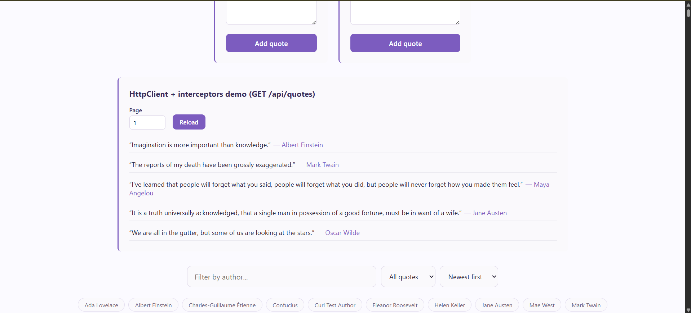
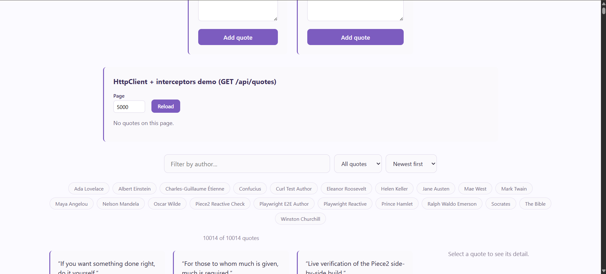
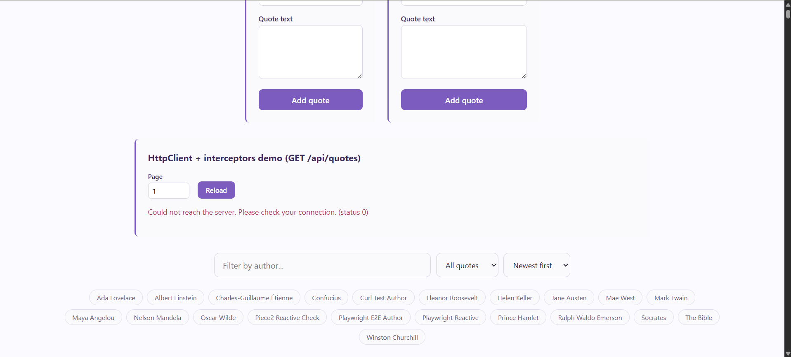

## Objective

Direct an agent to pin the real Week-1 API contract with a characterization test (green before any UI), then wire Angular `HttpClient` + functional interceptors against that same contract: auth header, retry-with-backoff on idempotent GETs, and ProblemDetails/ValidationProblemDetails mapped to a typed, friendly app error.

## 1. Brief given to the agent

> **Goal**: Characterize the real Week-1 QuotesApi contract with a backend test, then build Angular `HttpClient` functional interceptors against it: an auth interceptor, a retry-with-backoff interceptor for idempotent GETs, and an error interceptor that maps ProblemDetails/ValidationProblemDetails 4xx responses to a typed `AppError` with a friendly message.
>
> **Real API contract** (Week-1 QuotesApi, base `http://127.0.0.1:5220`) — read from the actual source, not assumed:
>
> - `GET /api/quotes?page=N&size=N` → 200, `Quote[]` (`{id, author, text, userId, createdAt, tags}`). Defaults `page=1, size=10`. Invalid pagination (`page<1` or `size` outside 1–100) → **400 as a bare string** (`Results.BadRequest(string)`), **not** ProblemDetails.
> - `GET /api/quotes/{id}` → 200 `Quote` or 404 (empty body).
> - `POST /api/quotes` (also `POST /cqrs/quotes`), requires `Authorization: Bearer <token>` with `quotes.write` scope: `author`/`text` required, `author` ≤100 chars, `text` ≤1000 chars → on failure, real **ValidationProblemDetails**: `{title, status, errors: {field: [messages]}}`.
>
> **Deliverable order matters**: write the characterization test first and get it green against the real running backend, *before* touching any Angular code. Then build the interceptors and register them via `provideHttpClient(withInterceptors([...]))`. Replace the existing manual `authService.authHeader()` call in `QuoteService.createQuote` with the new auth interceptor — don't leave both.
>
> **States to verify live**: loading, empty (real empty page), a real friendly-4xx (from the plain-string `GET /api/quotes?page=0` shape, which is *not* ProblemDetails — don't assume it is), a successful retry after a transient failure, and no retry on a real 4xx or on a POST.

## 2. Agent's output

**Characterization test** (`QuotesApi.Tests/QuotesContractCharacterizationTests.cs`), run and green before any UI work:
```csharp
[Fact]
public async Task GetQuotes_InvalidPage_Returns400AsPlainString_NotProblemDetails()
{
    // Pins a real gotcha: unlike the write endpoints, this 400 is a bare
    // string via Results.BadRequest(string), not { title, status, errors }.
    var response = await client.GetAsync("/api/quotes?page=0&size=5");

    Assert.Equal(HttpStatusCode.BadRequest, response.StatusCode);
    var body = await response.Content.ReadAsStringAsync();
    Assert.DoesNotContain("\"errors\"", body);
    Assert.DoesNotContain("\"title\"", body);
    Assert.Contains("Page must be >= 1", body);
}
```
Plus tests for the real `{id, author, text}` shape on `GET /api/quotes`, real `ValidationProblemDetails` on `POST /api/quotes`, and anonymous → 401. **4/4 green, run before any Angular code.**

**Functional interceptors** (`quotes-feed/src/app/core/http/`):
```typescript
// auth.interceptor.ts
export const authInterceptor: HttpInterceptorFn = (req, next) => {
  const authHeader = inject(AuthService).authHeader();
  if (!authHeader['Authorization']) return next(req);
  return next(req.clone({ setHeaders: authHeader }));
};

// retry.interceptor.ts
export const retryInterceptor: HttpInterceptorFn = (req, next) => {
  if (req.method !== 'GET') return next(req);
  return next(req).pipe(
    retry({
      count: 2,
      delay: (error, retryCount) => {
        const isTransient = error instanceof HttpErrorResponse && (error.status === 0 || error.status >= 500);
        if (!isTransient) throw error;
        return timer(300 * 2 ** (retryCount - 1));
      },
    }),
  );
};

// error.interceptor.ts
export function mapToAppError(err: HttpErrorResponse): AppError {
  const body = err.error;
  if (err.status === 0) return new AppError('Could not reach the server. Please check your connection.', 0);
  if (err.status >= 400 && err.status < 500 && body && typeof body === 'object') {
    if ('errors' in body && body.errors) {
      const errors = body.errors as Record<string, string[]>;
      return new AppError(Object.values(errors)[0]?.[0] ?? body.title, err.status, errors);
    }
    if ('title' in body) return new AppError(body.title, err.status);
  }
  if (err.status === 401 || err.status === 403) return new AppError('You must be logged in to do that.', err.status);
  return new AppError('Something went wrong. Please try again.', err.status);
}
```
Registered in `app.config.ts`:
```typescript
provideHttpClient(withInterceptors([authInterceptor, errorInterceptor, retryInterceptor]))
```
`QuoteService.createQuote` no longer passes `headers: this.authService.authHeader()` manually — the interceptor does it now.

## 3. The bug caught (and fixed) reading the diff

The first pass registered interceptors in the order they read naturally left-to-right: `[authInterceptor, retryInterceptor, errorInterceptor]`. That compiled, and every existing test still passed — but Angular interceptor **responses flow back in reverse of the registration order**. With that order, `errorInterceptor` sits *closer to the backend* than `retryInterceptor`, so it converts the raw `HttpErrorResponse` into an `AppError` before `retryInterceptor` ever sees it. `retryInterceptor`'s backoff logic checks `error instanceof HttpErrorResponse` — false for an `AppError` — so it immediately rethrows without ever retrying.

Wrote an integration test (`interceptor-chain.integration.spec.ts`) that registers the interceptors in the exact order used in `app.config.ts` and drives a real transient-503-then-success sequence through `HttpTestingController`:
```
AppError: Something went wrong. Please try again.
Serialized Error: { friendlyMessage: '...', status: 503, fieldErrors: undefined }
```
Confirmed: **zero retries ever happened**, for any request, silently — the retry interceptor existed and looked correct in isolation, but was dead code in the actual registered chain. Every transient failure would have looked identical to a permanent one to the end user.

**Fix**: reordered to `[authInterceptor, errorInterceptor, retryInterceptor]` so `retryInterceptor` sits closer to the backend and sees the raw error first. Re-ran the same integration test — now passes, and confirmed live (see §4).

## 4. Verification log

All states re-verified live against the real running backend (`http://127.0.0.1:5220`) and frontend (`http://localhost:4200`). Note: the database was later swapped back to restore Day 14's accumulated quotes (10,014 of them), so the specific `Quote #1 by Interceptor Live Check` quote referenced below no longer exists in the live app — the verification itself was real and live at the time; only the underlying data has since changed. The "Friendly 4xx" and "Empty" screenshots below (`02-Page-Empty-Error.png`, and `03-Server-Down-Error.png`, a genuine `status 0` network failure captured when the backend was briefly stopped) reflect the current, larger dataset.

- **Empty**: fresh database, `GET /api/quotes?page=1&size=5` → real `[]` → demo panel shows "No quotes on this page."
- **Loading**: demo panel shows a loading message immediately on mount, before the real request resolves.
- **Auth header via interceptor**: logged in as `test@example.com`, submitted the create-quote form — captured the real outgoing `POST /cqrs/quotes` request and confirmed `Authorization` header present, with **zero manual header code left in `QuoteService`**.
- **Success**: created a real quote via the create-quote form (confirmed `Quote #1 by Interceptor Live Check added.`), then reloaded the demo panel — the same quote's text and author appeared in the `GET /api/quotes` list.
- **Friendly 4xx (real, not mocked)**: set the demo panel's page to `0`, triggering the real `GET /api/quotes?page=0&size=5` → real backend 400 plain string → UI showed **"Something went wrong. Please try again. (status 400)"**, never the raw `"Page must be >= 1..."` string.
- **Retry-with-backoff (post-fix)**: intercepted `GET /api/quotes?page=1&size=5` to fail once with a real 503 then succeed — **2 real requests observed**, ~321ms apart (matches the 300ms base backoff), and the recovered data rendered.
- **No retry on a real 4xx**: intercepted the `page=0` request — **exactly 1 request made**, no retry.
- **No retry on POST**: unit-tested (`interceptor-chain.integration.spec.ts`) — a POST that fails with a transient 503 is never retried, since only `GET` is eligible.
- **Real network failure (status 0)**: caught genuinely, not staged — with the backend briefly stopped, the demo panel showed **"Could not reach the server. Please check your connection. (status 0)"** (see `03-Server-Down-Error.png`), confirming the `err.status === 0` branch of `mapToAppError` fires correctly on an actual connection failure, not just a mocked one.

**Tests**: backend — 4/4 characterization tests green (run before any UI code), full `QuotesApi.Tests` suite otherwise unaffected (3 pre-existing, unrelated flaky benchmark/ordering failures, not touched by this work). Frontend — 44/44 passing, including the new `error.interceptor.spec.ts` (5 tests), `auth.interceptor.spec.ts` (2), `interceptor-chain.integration.spec.ts` (3, including the ordering bug regression test), and `api-quotes-demo.component.spec.ts` (4).

## 5. What breaks if the Week-1 API contract changes

- If `GET /api/quotes`'s invalid-pagination response ever changed from a plain string to real `ValidationProblemDetails`, `mapToAppError` would start taking the `'errors' in body` branch instead of falling through to the generic message — an **improvement**, not a break, since the mapping already handles both shapes. But if the reverse happened (a ValidationProblemDetails endpoint started returning a plain string), field-level errors would silently collapse into the generic "Something went wrong" message, with no way to tell which field was invalid.
- If a 5xx endpoint started including a response body shaped like ProblemDetails (`{title, status}`) instead of an empty body, `mapToAppError`'s `err.status >= 400 && err.status < 500` guard means 5xx bodies are never inspected at all — the generic message would still show, which is arguably correct (5xx is a server bug, not a client-actionable state), but it means server-provided detail on a 5xx is always thrown away by design.
- If `POST /api/quotes`/`POST /cqrs/quotes` ever stopped requiring the `quotes.write` scope, `authInterceptor` would still attach whatever token exists — harmless, since the interceptor doesn't know or care what scope is required, it just forwards the current token.
- If the retry-eligible status range changed (e.g., the API started returning `429 Too Many Requests` for rate limiting, which is arguably transient), `retryInterceptor`'s `isTransient` check (`status === 0 || status >= 500`) would **not** retry a 429 today — it would need an explicit carve-out.

## Screenshots
### 1. Live List From Api

### 2. Page Empty Error

### 3. Server Down Error
