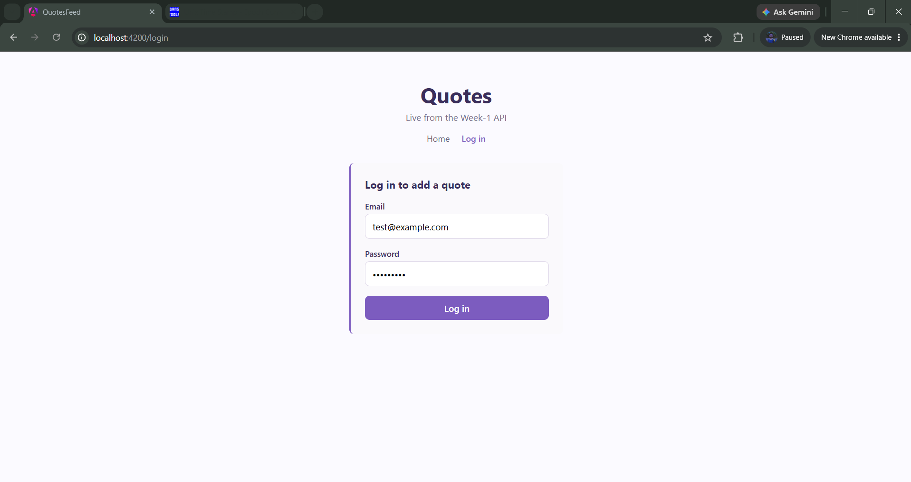
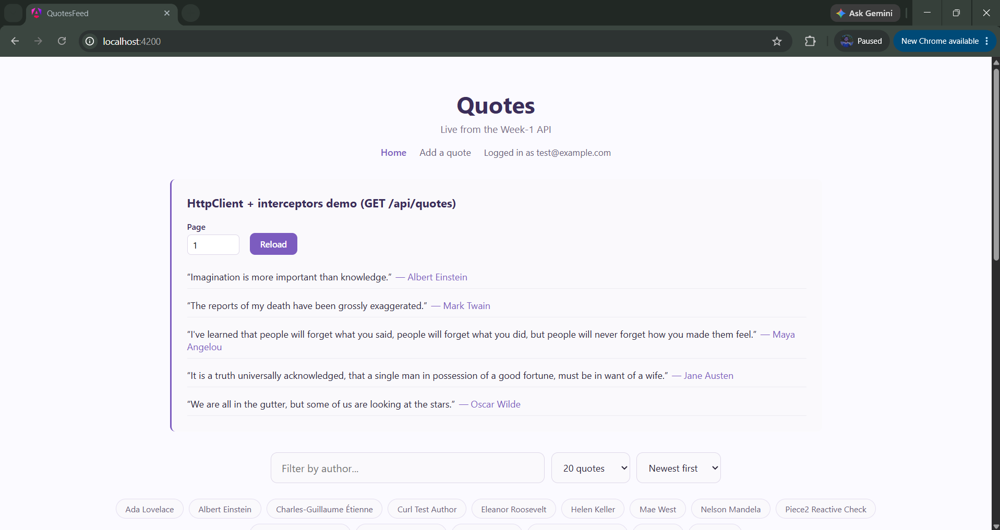
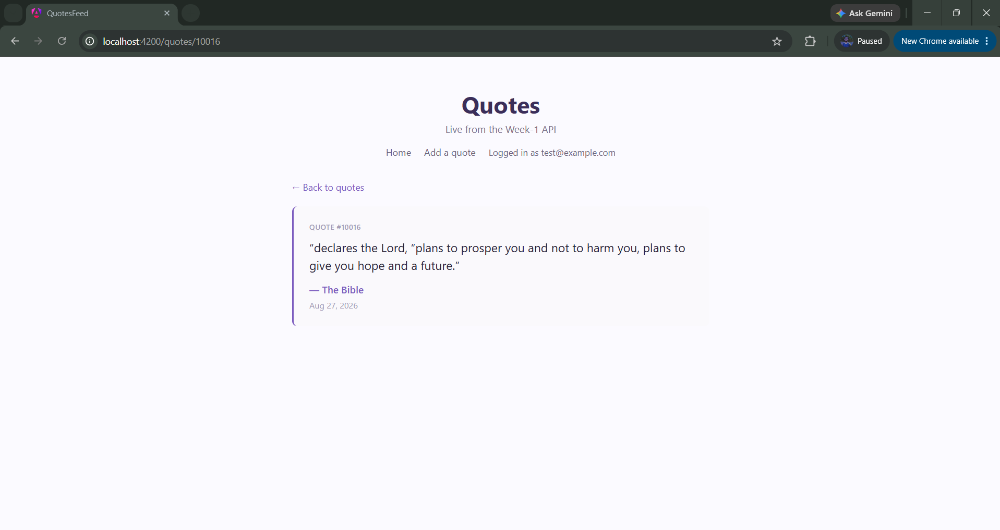
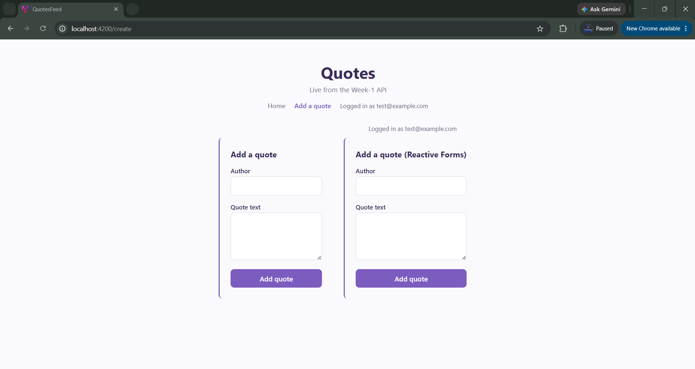

## Objective

Direct an agent to build real Angular Router routing against the Week-1 API: lazy-loaded routes, a functional auth guard, a route param carrying the real quote id, and a View Transition between the quotes list and a quote detail page. Read the diff like a junior's PR, verify live (network tab + guard redirect), and defend the result.

## 1. Brief given to the agent

> **Goal**: This app (`quotes-feed`) has no routing at all yet — the quote list and its detail view are both rendered inline via a signal (`selectedId`), and the create-quote forms/login form are always mounted, gated only by an `@if`. Replace that with real Angular Router: a home route (quote list), a lazy-loaded quote-detail route with a real route param, a lazy-loaded create-quote route protected by a functional auth guard, and a View Transition between the list and the detail page.
>
> **Real API contract** (Week-1 QuotesApi, base `http://127.0.0.1:5220`):
> - List: `GET /cqrs/quotes/feed?page=N&sort=...&size=N` → `QuoteFeedItem[]` (`{id, author, text, createdAt, tags}`).
> - Detail: `GET /api/quotes/{id}` → 200 `QuoteDetail` (`{id, author, text, userId, createdAt, tags}`) or 404. The real id field is `id` (int) — the backend route is typed `{id:int}`, so a non-numeric id never even reaches the handler.
> - Create: `POST /cqrs/quotes`, requires `Authorization: Bearer <token>` with `quotes.write` scope (already wired via `authInterceptor`).
>
> **Routes to build**:
> - `/` — quote list (eager, it's the landing page).
> - `/quotes/:id` — quote detail, **lazy-loaded**, `:id` is the real `id` field above. Reuse the existing `QuoteDetailComponent` (fetch logic already correct) — don't duplicate its `QuoteService.getById()` call.
> - `/create` — the two create-quote forms, **lazy-loaded**, behind a **functional** `CanActivateFn` guard that checks `AuthService.isAuthenticated()` and redirects to `/login?redirectTo=<attempted-url>` when not authenticated.
> - `/login` — lazy-loaded, redirects back to `redirectTo` (or `/`) once `isAuthenticated()` becomes true.
>
> **States to verify live, not just unit-tested**: the guard actually redirecting an unauthenticated visit to `/create`; the detail route's chunk actually appearing as a separate network request (not bundled into `main.js`); a non-numeric route param; a syntactically valid but nonexistent id (real 404); and a successful login returning the user to the page the guard originally blocked.

## 2. Agent's output

**Route config** (`app.routes.ts`):
```typescript
export const routes: Routes = [
  { path: '', component: HomeComponent },
  {
    path: 'quotes/:id',
    loadComponent: () => import('./quote-feed/quote-detail-page.component').then((m) => m.QuoteDetailPageComponent),
  },
  {
    path: 'create',
    canActivate: [authGuard],
    loadComponent: () => import('./create-quote/create-quote-page.component').then((m) => m.CreateQuotePageComponent),
  },
  { path: 'login', loadComponent: () => import('./auth/login-page.component').then((m) => m.LoginPageComponent) },
  { path: '**', redirectTo: '' },
];
```

**Functional guard** (`auth/auth.guard.ts`):
```typescript
export const authGuard: CanActivateFn = (_route, state) => {
  const authService = inject(AuthService);
  const router = inject(Router);

  if (authService.isAuthenticated()) return true;
  return router.createUrlTree(['/login'], { queryParams: { redirectTo: state.url } });
};
```

**Detail route param → real `id` field** (`quote-feed/quote-detail-page.component.ts`, final, after the fix in §3):
```typescript
export class QuoteDetailPageComponent {
  /** Bound from the real Week-1 route param -- GET /api/quotes/{id}'s id field. */
  readonly id = input<string>();

  readonly quoteId = computed(() => {
    const raw = this.id();
    if (raw === undefined) return null;
    const parsed = Number(raw);
    return Number.isNaN(parsed) ? null : parsed;
  });
}
```

**View Transition + input binding** (`app.config.ts`):
```typescript
provideRouter(routes, withComponentInputBinding(), withViewTransitions()),
```

`quote-feed.component.html` now navigates instead of toggling a signal:
```html
<a class="quote-card" [routerLink]="['/quotes', quote.id]">
  <p class="quote-text">&ldquo;{{ quote.text }}&rdquo;</p>
  <p class="quote-author">&mdash; {{ quote.author }}</p>
</a>
```

## 3. The bug caught (and fixed) reading the diff

The first pass wired `QuoteDetailPageComponent.id` as a component `input()`, and registered the router with:
```typescript
provideRouter(routes, withViewTransitions()),
```
This compiled cleanly and looked correct — `input()` reading a route param is the standard modern Angular pattern. But Angular only binds route params onto matching component inputs when `withComponentInputBinding()` is explicitly passed to `provideRouter()`. Without it, the input is simply never set — not an error, just silently `undefined` forever.

Wrote an integration test (`app.routes.integration.spec.ts`) that navigates the **real route config** end to end (via `RouterTestingHarness`, not the component in isolation):
```
lazy-loads the detail route and passes the real :id route param to GET /api/quotes/{id}
  Error: Expected one matching request for criteria "Match by function: ", found none.
```
Confirmed: navigating to `/quotes/42` never called `GET /api/quotes/42` at all. `QuoteDetailPageComponent`'s own unit tests (which set the input directly via `fixture.componentRef.setInput('id', '42')`) all passed, because they never went through the router — so the bug was invisible everywhere except an end-to-end route navigation. Live-verified with Playwright before the fix: visiting `/quotes/10015` in the real browser showed "Invalid quote id in the URL." for a perfectly valid, existing quote id.

**Fix**: added `withComponentInputBinding()` to `provideRouter()`. Re-ran the integration test — now passes; confirmed live afterward (see §4).

## 4. Verification log

All states exercised live against the real running backend (`http://127.0.0.1:5220`) and frontend (`http://localhost:4200`):

- **Guard redirect (unauthenticated)**: visited `/create` directly (cold, logged out) → landed on `http://localhost:4200/login?redirectTo=%2Fcreate`, real login form rendered.
- **Guard pass (authenticated)**: logged in as `test@example.com` on that same redirected page → returned to `/create`, both create-quote forms rendered.
- **Lazy loading, in the network tab (post-fix)**: clicked a real quote card (`/quotes/10015`) — exactly one new JS request fired, `chunk-7XLPIG6R.js` (the build log independently names this chunk `quote-detail-page-component`), confirming the detail route is not bundled into `main.js`. Real detail content rendered: **Quote #10015**, "If you want something done right, do it yourself." — Charles-Guillaume Étienne.
- **Missing/invalid route param**: `/quotes/not-a-number` → `quoteId()` computed to `null` → "Invalid quote id in the URL.", **zero** API calls made (verified no matching request in the unit test; confirmed live).
- **Valid format, nonexistent id (real 404)**: `/quotes/999999999` → real `GET /api/quotes/999999999` → backend 404 → "Could not load this quote."
- **View Transition**: monkey-patched `document.startViewTransition` before a list→detail navigation and confirmed it was actually invoked by the real Angular Router navigation, not just configured and unused.

**Tests**: 52/52 passing, including `auth.guard.spec.ts` (2), `quote-detail-page.component.spec.ts` (3), and `app.routes.integration.spec.ts` (3 — the one that caught the bug above).

## 5. What breaks if the Week-1 API's detail route or id field changes

- If `GET /api/quotes/{id}` were renamed (e.g., to `GET /api/quotes/detail/{id}`), only `QuoteService.getById()` needs updating — the route param itself (`:id` in `app.routes.ts`) and `QuoteDetailPageComponent` are decoupled from the URL shape, they just pass a parsed number into the service. Low blast radius by design.
- If the id field in the response body were renamed (e.g., `id` → `quoteId`), `QuoteDetailComponent`'s template (`quote()!.id`) and `quote-feed.component.html`'s `[routerLink]="['/quotes', quote.id]"` would both silently render `undefined` in the URL and heading — no compile error, since `QuoteDetail`/`QuoteFeedItem` are plain interfaces, not runtime-validated.
- If the backend's route constraint changed from `{id:int}` to accept non-integer ids (e.g., slugs), the guard-adjacent `Number(raw)` / `Number.isNaN` parsing in `QuoteDetailPageComponent` would reject every legitimate slug as "Invalid quote id in the URL." — the client-side validation is currently coupled to the assumption that ids are numeric, matching today's real `{id:int}` constraint, not a hypothetical future one.
- If `/create`'s required auth scope changed (e.g., a new `quotes.admin` scope), `authGuard` would still let any authenticated user through — it only checks `isAuthenticated()`, not which scope the token carries, so a logged-in-but-under-scoped user would reach the page and only find out via a `403` on submit.

## Screenshots
### 1. Login Filled

### 2. Home Logged In

### 3. Quote Detail (Lazy-Loaded)

### 4. Create Page (Guard Passed)
