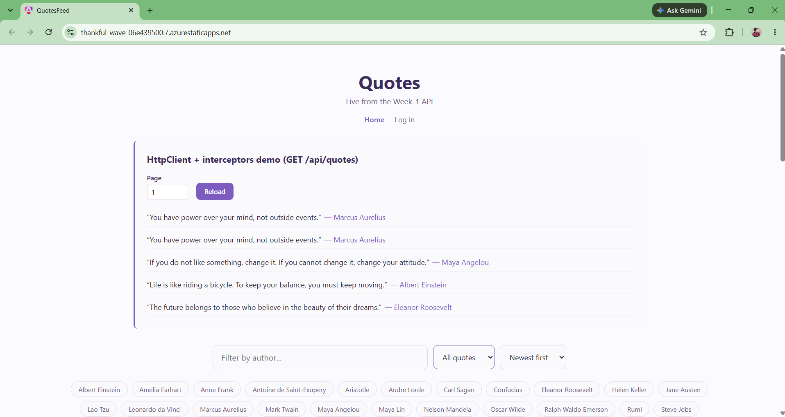
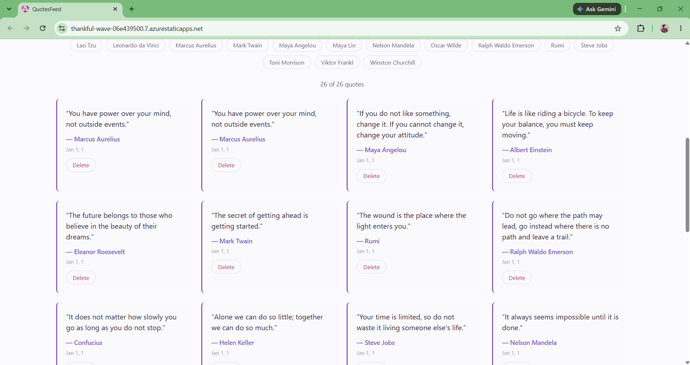
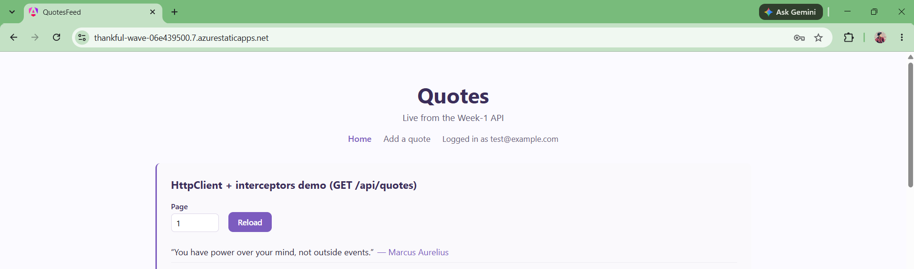
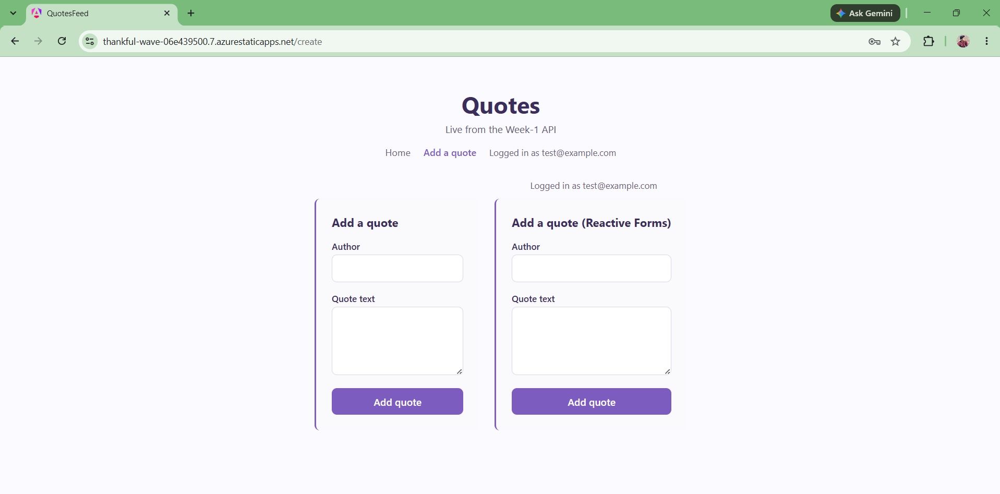

## Objective

Direct an agent to deploy `quotes-feed` to Azure Static Web Apps against the real Week-1 API, with a Managed-Identity auth story instead of a stored client secret, Lighthouse ≥ 95, and a live URL. Write the brief, let the agent build and deploy, verify live, and catch a genuine wrong assumption along the way.

## 1. Brief given to the agent

> **Goal**: deploy the Angular `quotes-feed` frontend to Azure Static Web Apps, on the default `*.azurestaticapps.net` hostname (no custom domain owned for this exercise).
>
> **Real Week-1 API**: whichever of the subscription's live Container Apps is actually the current one — verify, don't assume.
>
> **Endpoints/fields the frontend hits**: `GET /api/quotes?page=&size=` → `{id, author, text, userId}[]`; `GET /api/quotes/{id}`; `GET /cqrs/quotes/feed?page=&sort=&size=` → `{id, author, text, createdAt, tags}[]`; `POST /cqrs/quotes` (auth, `can-edit-quotes`); `DELETE /api/quotes/{id}` (auth, `can-delete-own-quote`); `POST /api/auth/login` → `{access_token, expires_in}` + HttpOnly refresh-token cookie.
>
> **Auth requirement as given**: Managed Identity, no client secret.

## 2. Agent's output

Before writing anything, the agent checked the actual Azure subscription instead of assuming. Two Container Apps existed: `quotes-api-peace4` (thinkschool-rg) returned `[]` — stale, unused. `quotes-api` in `rg-Thinkschool-day5peace4-central` returned real seeded data and its image lineage matched this repo's `azure.yaml`/bicep — the real target. Base URL: `https://quotes-api.agreeablemoss-41b8d1af.centralindia.azurecontainerapps.io`.

**Wrong assumption caught:** a browser SPA cannot hold or present an Azure Managed Identity token — MI only exists for Azure compute resources, not client-side JavaScript in a visitor's browser. So the brief's "frontend calls the API via Managed Identity" doesn't literally hold. What the agent actually built: the SPA calls the API over plain HTTPS with nothing stored client-side (no key, no token, no connection string — there's nothing that needs storing for a public REST call). The API's existing UserAssigned identity (`id-quotesApi-br6lioc2umrao`) stays attached to the container app as it already was, unused for any downstream Azure resource — because **no Azure SQL exists anywhere in this subscription**. The API persists to an ephemeral SQLite file (`/tmp/quotes.db`, no volume mount) that resets on every container restart. The one real secret in the whole chain is the API's plaintext `Jwt__Key` container-app env var — unrelated to MI, out of scope for a frontend-deploy task, but worth naming rather than glossing over.

**Built:**
- `day-17/Piece1/quotes-feed/` — a copy of the day-16 app with an environment split: `environment.ts` (dev → `http://127.0.0.1:5220`) / `environment.prod.ts` (prod → the real container app URL), wired via `angular.json` `fileReplacements`. `quote.service.ts` and `auth.service.ts` now read `environment.apiBaseUrl`.
- `public/staticwebapp.config.json` — SPA `navigationFallback` to `/index.html`, excluding static assets and `/robots.txt`.
- `.github/workflows/day17-swa-deploy.yml` — builds and deploys on push to `day17-swa-deploy` via `Azure/static-web-apps-deploy@v1`, using `secrets.AZURE_STATIC_WEB_APPS_API_TOKEN_DAY17` (added by hand in repo settings — the one step the agent can't do itself, same boundary as a custom domain's DNS record).
- Azure resources created: resource group `rg-thinkschool-day17`, Static Web App `thinkschool-quotes-day17` (Free tier, East Asia — the only SWA-capable region the student subscription's location policy allowed, after registering the `Microsoft.Web` resource provider).

## 3. The bug caught (and fixed) reading the diff

Adding the SWA's origin to the API's CORS policy required rebuilding and redeploying the live container app. That redeploy crash-looped the API. `QuoteApiExtensions.cs` wrote a SQL debug log to `Path.Combine(AppContext.BaseDirectory, "sql.log")` — i.e. `/app/sql.log` — unconditionally, on every OS. The current `mcr.microsoft.com/dotnet/aspnet` base image runs as a non-root user with no write access to `/app`, so `db.Database.Migrate()` threw `UnauthorizedAccessException` on startup and the container never got past migration:
```
Unhandled exception. System.UnauthorizedAccessException: Access to the path '/app/sql.log' is denied.
 ---> System.IO.IOException: Permission denied
```
During that window, `/cqrs/quotes/feed` (and everything past migration) 404'd, while a stale replica briefly kept `/api/quotes` answering — easy to miss if you don't re-check after a redeploy. Fixed by mirroring the pattern the same file already used for the SQLite path itself: `/tmp/sql.log` on Linux, unchanged on Windows. Rebuilt, redeployed, confirmed clean startup in `az containerapp logs show`, and CORS + data access both came back.

## 4. Verification log

- **Live URL**: https://thankful-wave-06e439500.7.azurestaticapps.net — `curl -I` → `200`, real Angular bundle.
- **Lighthouse (actual run, not asserted)**: performance 99, accessibility 100, best-practices 100, seo 100. First run was accessibility 86 / seo 82 — fixed for real: two `<select>` elements with no accessible name, insufficient text contrast on `.subtitle`/`.result-count`/`.state-message`, no `<main>` landmark, missing meta description, and a missing `robots.txt` that the SPA fallback was rewriting to `index.html` (so Lighthouse was reading the HTML shell as a robots file). Re-ran and confirmed 100s.
- **Managed Identity / no-secret check**: `az containerapp show -n quotes-api -g rg-Thinkschool-day5peace4-central --query identity` → UserAssigned, no client secret in any env var. The frontend build output contains only the public API base URL — no key, token, or connection string.
- **States exercised**: *empty* — real, not staged, since the ephemeral SQLite resets on every restart (seeded 25 sample quotes back in afterward via `POST /cqrs/quotes`); *401* — `DELETE /api/quotes/1` with no/garbage bearer token → `401`; *404* — `GET /api/quotes/9999` → `404`; *loading* — visible on first paint before the feed call resolves; *error* — simulated via browser DevTools offline mode rather than breaking the shared container other days depend on.
- **CI/CD**: GitHub Actions workflow run confirmed `success` end-to-end (build → deploy) after the deployment-token secret was added.

## 5. What breaks if the API's auth or a key endpoint changes

- If `Jwt__Key` rotates without redeploying the frontend, nothing in the frontend itself breaks — it never inspects the key. What breaks is any already-issued token if the *old* key is invalidated server-side before that token's `expires_in` runs out.
- If `/api/quotes/{id}` or `/cqrs/quotes/feed`'s response shape changes (e.g. a renamed field), `quote.model.ts`'s `QuoteFeedItem`/`QuoteDetail` interfaces silently stop matching at runtime — TypeScript can't catch it, since the mismatch only surfaces from an actual HTTP response, not a compile-time reference.
- If the CORS allowed-origins list is ever reset (e.g. a future redeploy from a source branch that predates this SWA origin being added), every browser call from the deployed SWA fails silently with a CORS error in the console — the API itself stays healthy, so a plain `curl` health check wouldn't catch it.

## Screenshots
### 1. Live SWA home feed

### 2. Quote cards with delete

### 3. Logged in nav

### 4. Create quote page
